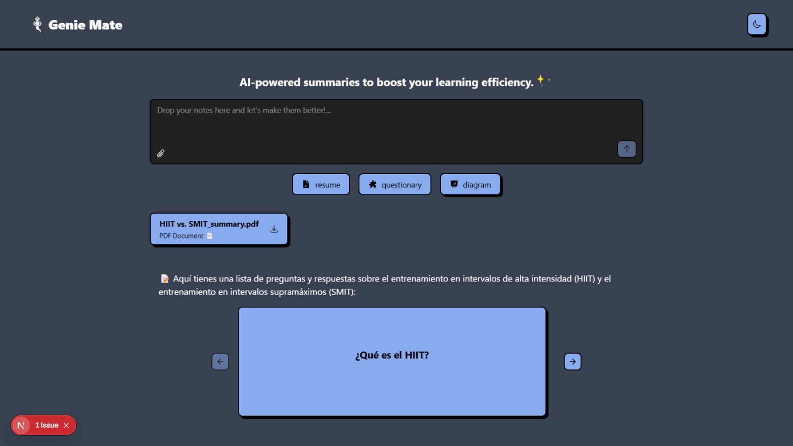
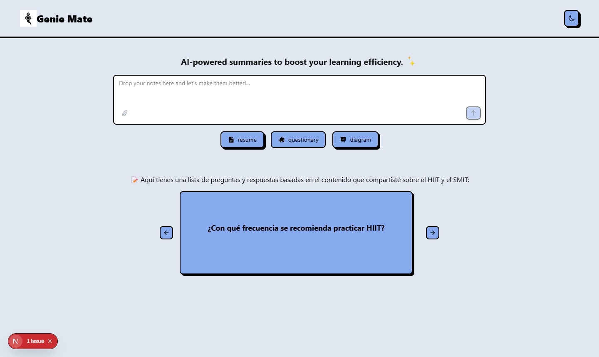

# Genie Mate ✨  
**AI-powered summaries to boost your learning efficiency**

Genie Mate is a student-focused study companion that transforms your notes into effective learning tools. Just upload your content and get AI-generated **summaries**, **questionnaires**, or **mind maps** to help you retain and understand concepts better.

  
  

---

## ✨ Features

- 📄 Upload notes in plain text or PDF format.
- ⚡ Get instant AI-generated summaries, question lists, or visual diagrams.
- 🌓 Light and dark mode support.
- 🎨 Beautiful UI using [shadcn/ui](https://ui.shadcn.com/) with a neobrutalism aesthetic.
- 🧠 Built with performance and simplicity in mind using [Next.js](https://nextjs.org/), [TanStack](https://tanstack.com/), and [Jotai](https://jotai.org/).
- 🔄 Efficient package management with `pnpm`.

---

## 🛠 Tech Stack

- **Frontend**: Next.js, TypeScript, Tailwind CSS, shadcn/ui, neobrutalism
- **State Management**: Jotai
- **Data Fetching**: TanStack Query
- **Package Manager**: pnpm
- **Collaboration**: Built by a team of three developers

---
